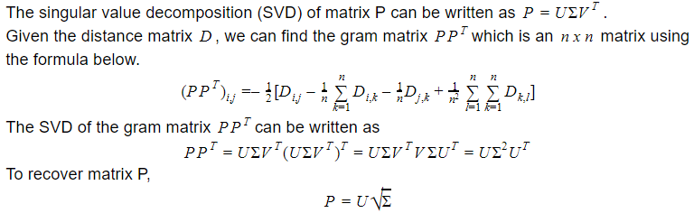
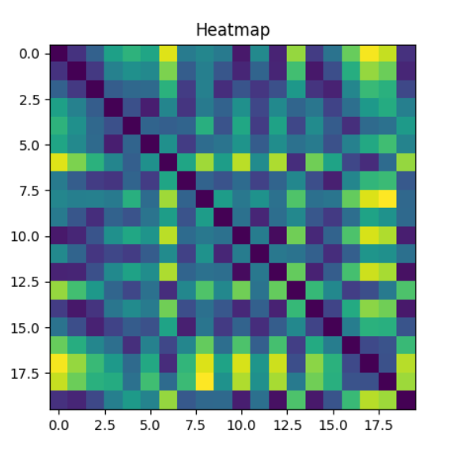
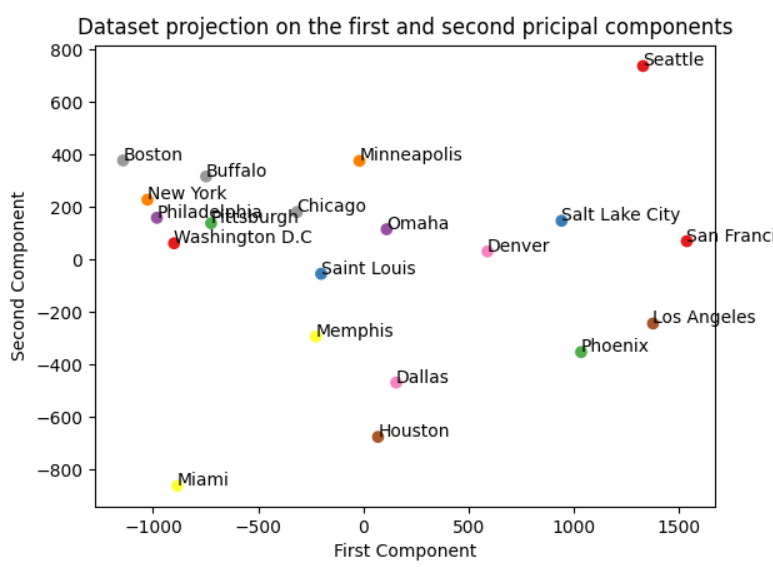

# Recovering Locations From Distances

## Problem Description
### Objective:
- Visualize the given distance matrix as a heatmap
- Create an algorithm that recovers the locations of the cities such that their pairwise distances remain the same
- Plot the recovered locations of the cities and identify the points to verify that the algorithm worked
### Given:
A distance matrix (nxn) of the distances between a set of cities. Contained in UScities.txt

## Solution and Proof
Given the distance matrix D, we can find the gram matrix of the set of points P (nxn matrix). We can use eigenvalue decomposition to recover the matrix P, which contains the locations of the points. Singular value decomposition generalizes the eigendecomposition to asymetric matrices (non-square). 

This algorithm is called **Multidimensional scaling**, which is used to recover points from pairwise distances.
https://en.wikipedia.org/wiki/Multidimensional_scaling
## Figures
### Heatmap of the euclidian distances

This heatmap is the 20x20 distance matrix from *UScities.txt*. The dark points are small distances and the bright points are large distances between cities.
### Plot of estimated city locations

Using the multidimensional scaling algorithm I recovered this map of 20 US cities that maintain the euclidian distances given in *UScities.txt*

## Code Walkthrough
TODO
