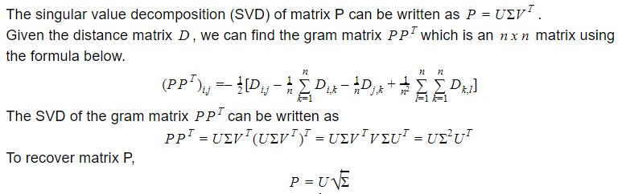

# Recovering Locations From Distances

## Problem Description
### Given:
A distance matrix (nxn) of the distances between a set of cities.
### Objective:
Create an algorithm that recovers the locations of the cities such that their pairwise distances remain the same.

## Solution and Proof
Given the distance matrix D, we can find the gram matrix of the set of points P (nxn matrix). We can use eigenvalue decomposition to recover the matrix P, which contains the locations of the points. Singular value decomposition generalizes the eigendecomposition to asymetric matrices (non-square). 

Proof: 

This algorithm is called **Multidimensional scaling**, which is used to recover points from pairwise distances.
https://en.wikipedia.org/wiki/Multidimensional_scaling
## Figures
Heatmap of the euclidian distances
Plot of estimated city locations

## Code Walkthrough

